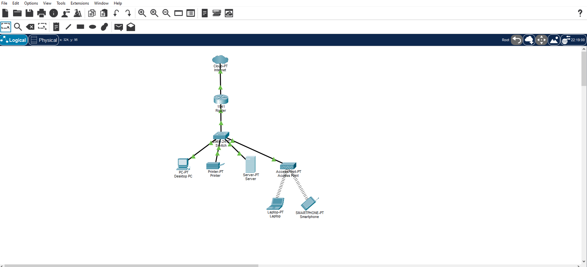
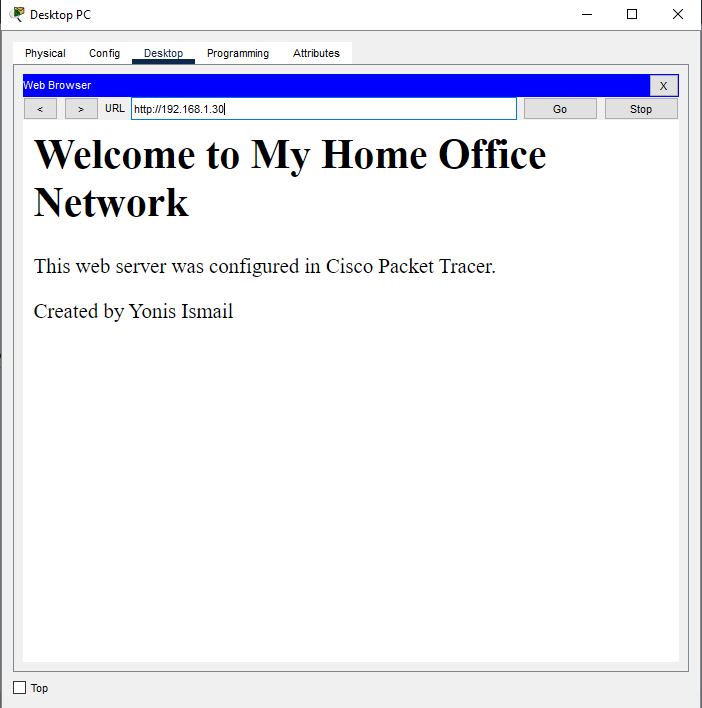

# 🏠 Home Office Network

## Overview

This project simulates a simple home office network using Cisco Packet Tracer.

The objective was to build a functioning network that allows wired and wireless devices to communicate, while hosting a local web server accessible from the desktop PC.

---
## Network Topology

## Web Server

---

## Devices Used

- Cisco 1941 Router
- Cisco 2960 Switch
- Wireless Access Point
- Desktop PC
- Laptop
- Smartphone
- Printer
- Server

---

## Network Configuration

- Configured static IP addresses for all devices.
- Set the router's LAN interface as the default gateway.
- Connected wired devices through a Cisco switch.
- Connected wireless devices through an Access Point.
- Enabled HTTP on the server.
- Verified connectivity using ICMP (ping).

---

## Testing

### Ping Test

The Desktop PC successfully communicated with the server.

**Result**

- 4 packets sent
- 4 packets received
- 0% packet loss

### HTTP Test

The Desktop PC accessed the server using:

http://192.168.1.30

The webpage loaded successfully.

---

## Skills Demonstrated

- Network topology design
- Static IP configuration
- Router configuration
- Switch configuration
- Wireless networking
- HTTP server configuration
- ICMP troubleshooting
- Cisco Packet Tracer
- Git & GitHub

---

## What I Learned

This project helped me understand how devices communicate on a local network, how routers, switches and wireless access points work together, and how to verify connectivity using ping and a web browser. It also gave me practical experience documenting and publishing projects using Git and GitHub.

---

## Author

**Yonis Ismail**